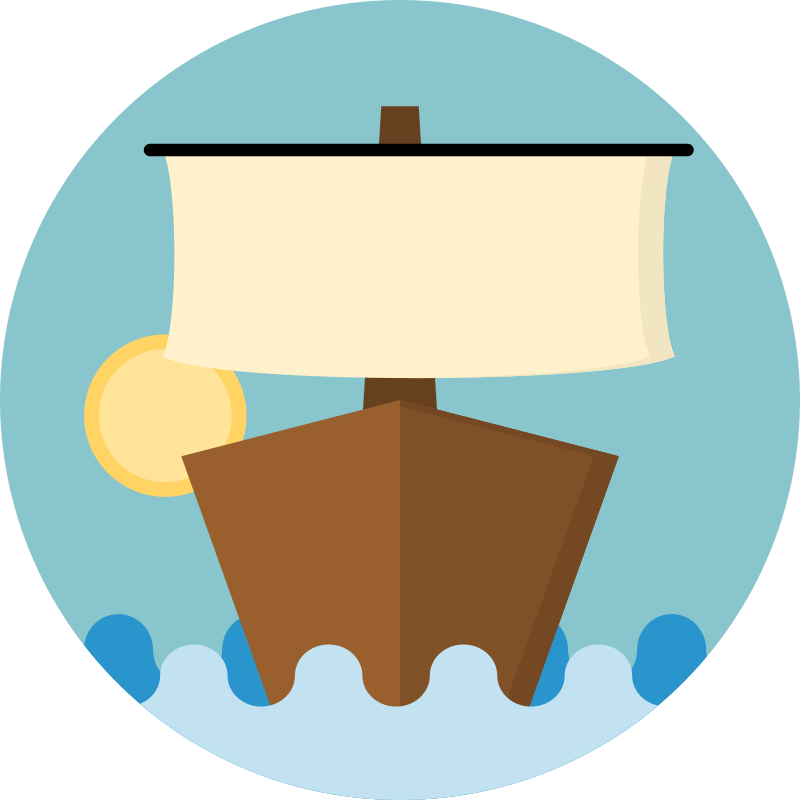

---
hide:
  - navigation
  - toc
---

# Kevel

  

    <em>Kevel, switch your kubernetes client without friction</em>

---

**Documentation**: <a href="https://kevel.readthedocs.io" target="_blank">https://kevel.readthedocs.io</a>

**Source Code**: <a href="https://github.com/germainlefebvre4/kevel" target="_blank">https://github.com/germainlefebvre4/kevel</a>

---

> Definition: Kevel, a large cleat fitted to the gunwale of a ship and used for securing ropes.